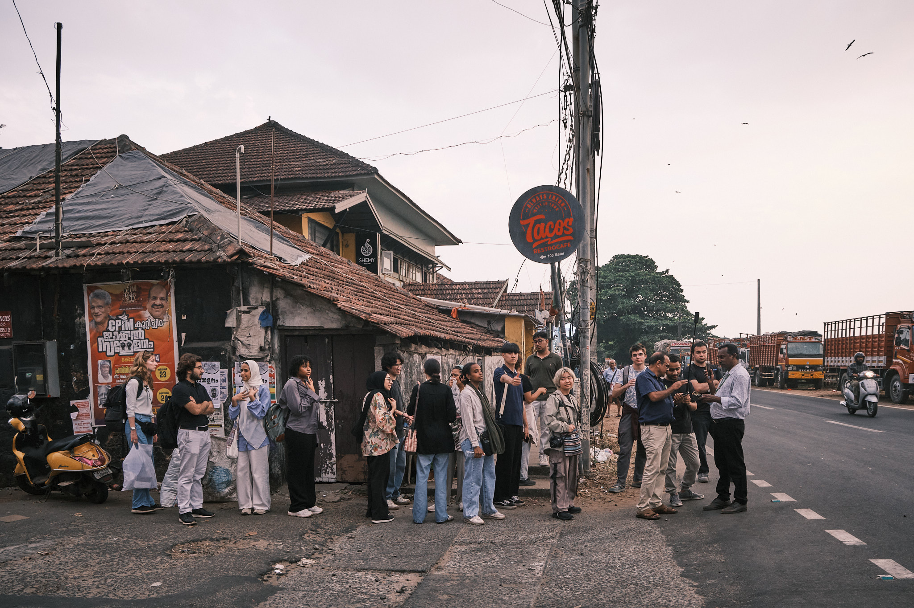

# Approaches to Kerala

> Exploring Expressive Culture through Different Mediums

## About the Project

A collaborative ethnographic exploration by NYU Abu Dhabi students documenting Kerala's rich cultural landscape. Through various mediums including forms, audio, photo, and video, it captures Kerala's living traditions, religious practices, and social movements.

## Technical Implementation

### Built With
- Next.js 14 (App Router)
- Framer Motion
- Tailwind CSS
- TypeScript